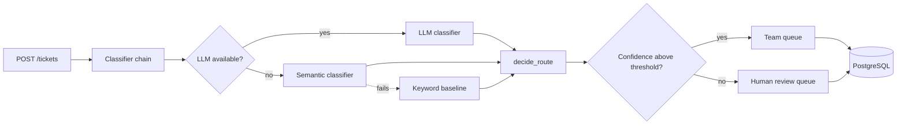

# Ticket Auto-Router

An LLM-powered service that classifies incoming customer support tickets and routes them to the right team queue, with measured accuracy, tracked cost, and graceful degradation when the LLM is unavailable.

> **Status:** in active development. Sections marked *pending* are filled in as each milestone lands.

---

## What it does

A support ticket arrives through the API. The service:

1. **Classifies** it into a category (billing, technical, account, complaint, other) with a confidence score.
2. **Routes** it to a team queue using deterministic business rules, such as escalating complaints from premium customers.
3. **Flags** low-confidence decisions for human review instead of guessing.
4. **Persists** the ticket, the classification, the routing decision, and the cost of every LLM call.

Classification runs through a **fallback chain**. The LLM is tried first, then an embedding-similarity classifier, then a keyword baseline. If the LLM API is down, tickets are still routed, and every response records which classifier actually answered.



---

## Design principles

**Dependencies point inward.** The code is organised in three rings:

- **Core (`domain/`).** Models and routing rules. It imports nothing from the rest of the app and performs no I/O.
- **Edges (`classification/`, `storage/`, `api/`).** The replaceable parts: classifiers, database, HTTP.
- **Wiring (`config.py`).** Builds the object graph from settings.

**Routing is business logic, not model output.** The LLM only classifies. Which queue a ticket goes to is decided by a pure, fully tested function, so business rules can change without touching a prompt and can be verified without calling an API.

**One interface for every classifier.** Each classifier implements the same `Classifier` protocol (`classify(text) -> Classification`). That single seam is what makes the fallback chain, the evaluation harness, and side-by-side comparisons possible.

**Illegal states are unrepresentable.** Domain models validate at construction. A confidence outside 0 to 1, for example, cannot exist.

**Measure before adding intelligence.** A golden dataset and an evaluation harness were built before any ML, so every classifier is judged against the same baseline numbers.

Detailed reasoning for each decision lives in [`docs/adr/`](docs/adr/).

---

## Evaluation

*Pending.* Results are produced by the evaluation runner against a hand-labelled golden set of support tickets, including ambiguous and edge cases. Labelling decisions are documented in [`docs/evaluation.md`](docs/evaluation.md).

| Classifier | Accuracy | p50 latency | Cost per 1,000 tickets |
|---|---|---|---|
| Keyword baseline | - | - | - |
| Semantic (all-MiniLM-L6-v2) | - | - | - |
| LLM | - | - | - |
| Fallback chain | - | - | - |

---

## Tech stack

| Area | Tools |
|---|---|
| API | FastAPI, Pydantic |
| Storage | PostgreSQL, SQLAlchemy, Alembic |
| Classification | sentence-transformers (`all-MiniLM-L6-v2`), <!-- TODO: LLM provider --> |
| Testing | pytest, Testcontainers, Hypothesis |
| Quality | ruff, mypy (strict), pre-commit |
| Infrastructure | Docker, Docker Compose, GitHub Actions |
| Load testing | <!-- TODO: k6 or Locust --> |

---

## Getting started

### Prerequisites

- Python <!-- TODO: version, e.g. 3.12 -->
- Docker and Docker Compose
- An API key for the LLM provider (optional: without one, the service falls back to non-LLM classifiers)

### Run with Docker

```bash
git clone https://github.com/elamurg/ticket-auto-router.git
cd ticket-auto-router
cp .env.example .env        # then add your API key
docker compose up --build
```

The API is served at `http://localhost:8000`. Interactive docs are at `http://localhost:8000/docs`.

### Local development

```bash
python -m venv .venv
source .venv/bin/activate
pip install -e ".[dev]"
pre-commit install
```

### Checks

```bash
ruff check .          # lint
ruff format .         # format
mypy src              # type check
pytest                # tests (integration tests need Docker running)
```

### Run an evaluation

```bash
python -m router.evaluation.runner --classifier keyword
```

Reports print to the terminal and are saved to `results/<classifier>-<timestamp>.json`.

---

## API

*Pending.*

| Method | Endpoint | Description |
|---|---|---|
| `POST` | `/tickets` | Submit a ticket; returns the routing decision. Supports an `Idempotency-Key` header. |
| `GET` | `/tickets/{id}` | Retrieve a ticket and its decision |
| `GET` | `/tickets?queue=&requires_human=` | List tickets by queue or review status |
| `GET` | `/health` | Service and database health |

---

## Project structure

```
src/router/
├── domain/              Core: models, routing rules, domain errors
├── classification/      Classifier protocol, keyword, semantic, LLM, fallback chain
├── storage/             ORM tables and the ticket repository
├── api/                 Request/response schemas and endpoints
├── evaluation/          Golden set loader, metrics, evaluation runner
└── config.py            Settings and object wiring
data/                    Golden dataset
docs/                    Evaluation writeups, performance results, ADRs
tests/
```

---

## Roadmap

- [ ] Tooling, containerised environment, CI gate on `main`
- [ ] Domain models, routing rules, keyword baseline
- [ ] Golden dataset, metrics, evaluation runner
- [ ] Semantic classifier and comparison against baseline
- [ ] LLM classifier with retries, timeouts, cost tracking, fallback chain
- [ ] Persistence, REST API, idempotency, structured logging
- [ ] Human review queue, circuit breaker, property-based tests, load testing

---

## License

<!-- TODO: e.g. MIT -->