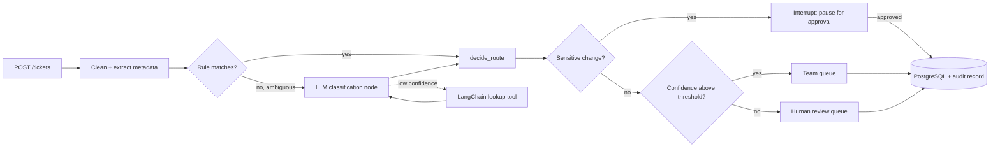

# Ticket Auto-Router

An LLM-powered service that classifies incoming customer support tickets and routes them to the right team queue, with measured accuracy, tracked cost, a human checkpoint before sensitive changes, and graceful degradation when the LLM is unavailable.

> **Status:** in active development. Sections marked *pending* are filled in as each milestone lands. The classification stage is built as a LangGraph pipeline with LangSmith tracing, deployed to GCP; see [`docs/backlog.md`](docs/backlog.md) for the full sprint plan and the reasoning behind that choice.

---

## What it does

A support ticket arrives through the API, which validates it and stores an idempotency key so a retry never creates a duplicate. From there:

1. **Cleans** the text and extracts safe metadata (language, length, obviously unsafe content) before anything reaches a model.
2. **Routes obvious cases by rule**, no model call. Genuinely ambiguous language goes to an **LLM classification node**, which can call a **lookup tool** over a runbook and prior tickets for extra context when its confidence is low.
3. **Pauses before a sensitive change** (for example an auto-approved refund or an account closure) and waits for a human decision instead of finalizing it.
4. **Routes** the result to a team queue using deterministic business rules, such as escalating complaints from premium customers, and **flags** low-confidence decisions for human review.
5. **Persists** the ticket, the classification, the routing decision, the cost of every LLM call, and an audit record of what the pipeline did — which nodes ran, whether it paused, what it looked up.

Classification runs through a **fallback chain**. The LangGraph LLM pipeline is tried first, then an embedding-similarity classifier, then a keyword baseline. If the LLM API is down, tickets are still routed, and every response records which classifier actually answered. Every pipeline run is traced in **LangSmith**, so a decision can be inspected node by node after the fact.



If the LLM is unavailable, the graph is skipped entirely and the fallback chain (semantic, then keyword) answers instead, still ending at `decide_route`.

---

## Design principles

**Dependencies point inward.** The code is organised in three rings:

- **Core (`domain/`).** Models, routing rules, and the sensitive-change predicate. It imports nothing from the rest of the app and performs no I/O.
- **Edges (`classification/`, `pipeline/`, `tools/`, `storage/`, `api/`).** The replaceable parts: classifiers, the LangGraph nodes and graph, the LangChain lookup tool, database, HTTP.
- **Wiring (`config.py`, `tracing.py`).** Builds the object graph from settings; turns on LangSmith tracing when configured.

**Routing is business logic, not model output.** The LLM only classifies. Which queue a ticket goes to, and whether a change is sensitive enough to need approval, are decided by pure, fully tested functions, so business rules can change without touching a prompt or the graph and can be verified without calling an API.

**One interface for every classifier.** Each classifier implements the same `Classifier` protocol (`classify(text) -> Classification`), including the LangGraph pipeline, which sits behind a thin adapter satisfying the same protocol. That single seam is what makes the fallback chain, the evaluation harness, and side-by-side comparisons possible.

**A graph is not an excuse to skip a baseline.** The LangGraph pipeline is measured against the keyword and semantic classifiers with the same evaluation harness, not assumed to win because it's newer.

**Illegal states are unrepresentable.** Domain models validate at construction. A confidence outside 0 to 1, for example, cannot exist.

**Measure before adding intelligence.** A golden dataset and an evaluation harness were built before any ML, so every classifier — including the pipeline — is judged against the same baseline numbers.

**A human confirms before an irreversible action.** The pipeline pauses on a sensitive routing decision rather than acting on it, so the LLM proposes and a person disposes for anything hard to undo.

Detailed reasoning for each decision lives in [`docs/adr/`](docs/adr/).

---

## Evaluation

*Pending.* Results are produced by the evaluation runner against a hand-labelled golden set of support tickets, including ambiguous and edge cases. Labelling decisions are documented in [`docs/evaluation.md`](docs/evaluation.md).

| Classifier | Accuracy | p50 latency | Cost per 1,000 tickets |
|---|---|---|---|
| Keyword baseline | - | - | - |
| Semantic (all-MiniLM-L6-v2) | - | - | - |
| LLM (LangGraph pipeline) | - | - | - |
| Fallback chain | - | - | - |

---

## Tech stack

| Area | Tools |
|---|---|
| API | FastAPI, Pydantic |
| Storage | PostgreSQL, SQLAlchemy, Alembic |
| Classification | sentence-transformers (`all-MiniLM-L6-v2`), <!-- TODO: LLM provider --> |
| LLM pipeline | LangGraph (clean/extract, rule-first + LLM classification, interrupt), LangChain (runbook/ticket lookup tool), LangSmith (tracing, eval feedback) |
| Testing | pytest, Testcontainers, Hypothesis |
| Quality | ruff, mypy (strict), pre-commit |
| Infrastructure | Docker, Docker Compose, GitHub Actions |
| Deployment | GCP: Cloud Run, Artifact Registry, a free-tier Compute Engine VM running Postgres |
| Load testing | <!-- TODO: k6 or Locust --> |

---

## Getting started

### Prerequisites

- Python 3.12
- Docker and Docker Compose
- An API key for the LLM provider (optional: without one, the service falls back to non-LLM classifiers)
- A LangSmith API key (optional: tracing is opt-in via environment variables and the pipeline runs without it)
- A GCP account (optional, only needed for the deployment sprint; Cloud Run and a small VM stay within the Always Free tier)

### Run with Docker

```bash
git clone https://github.com/elamurg/ticket-auto-router.git
cd ticket-auto-router
cp .env.example .env        # then add your API key
docker compose up --build
```

The API is served at `http://localhost:8000`. Interactive docs are at `http://localhost:8000/docs`.

### Local development

```bash
python -m venv .venv
source .venv/bin/activate
pip install -e ".[dev]"
pre-commit install
```

### Checks

```bash
ruff check .          # lint
ruff format .         # format
mypy src              # type check
pytest                # tests (integration tests need Docker running)
```

### Run an evaluation

```bash
python -m router.evaluation.runner --classifier keyword
```

Reports print to the terminal and are saved to `results/<classifier>-<timestamp>.json`.

---

## API

*Pending.*

| Method | Endpoint | Description |
|---|---|---|
| `POST` | `/tickets` | Submit a ticket; returns the routing decision, or a pending-approval status if the pipeline paused on a sensitive change. Supports an `Idempotency-Key` header. |
| `GET` | `/tickets/{id}` | Retrieve a ticket and its decision |
| `GET` | `/tickets?queue=&requires_human=` | List tickets by queue or review status |
| `GET` | `/health` | Service and database health |

A pending-approval ticket is resumed through the human review queue (approve/reject), which continues its paused pipeline run instead of resubmitting the ticket.

---

## Project structure

```
src/router/
├── domain/              Core: models, routing rules, sensitive-change predicate, domain errors
├── classification/      Classifier protocol, keyword, semantic, LLM (LangGraph adapter), fallback chain
├── pipeline/            LangGraph state, nodes (clean/extract, classify, lookup, interrupt), compiled graph
├── tools/               LangChain lookup tool (runbook / prior tickets)
├── storage/             ORM tables, ticket repository, audit repository
├── api/                 Request/response schemas and endpoints
├── evaluation/          Golden set loader, metrics, evaluation runner
├── tracing.py           LangSmith wiring
└── config.py            Settings and object wiring
data/                    Golden dataset
docs/                    Evaluation writeups, performance results, ADRs, GCP teardown runbook
tests/
```

---

## Roadmap

- [x] Tooling, containerised environment
- [ ] CI gate on `main`
- [ ] Domain models, routing rules, keyword baseline
- [ ] Golden dataset, metrics, evaluation runner
- [ ] Semantic classifier and comparison against baseline
- [ ] LangGraph pipeline: clean/extract node, rule-first + LLM classification, LangChain lookup tool, cost tracking and LangSmith tracing, interrupt before sensitive changes, fallback chain
- [ ] Persistence (including audit records), REST API, idempotency, structured logging
- [ ] Human review queue and interrupt resumption, circuit breaker, property-based tests, load testing
- [ ] GCP deployment: IAM and secrets, Postgres on a free-tier VM, Cloud Run, CI/CD to Cloud Run, cost teardown

---

## License

<!-- TODO: e.g. MIT -->
